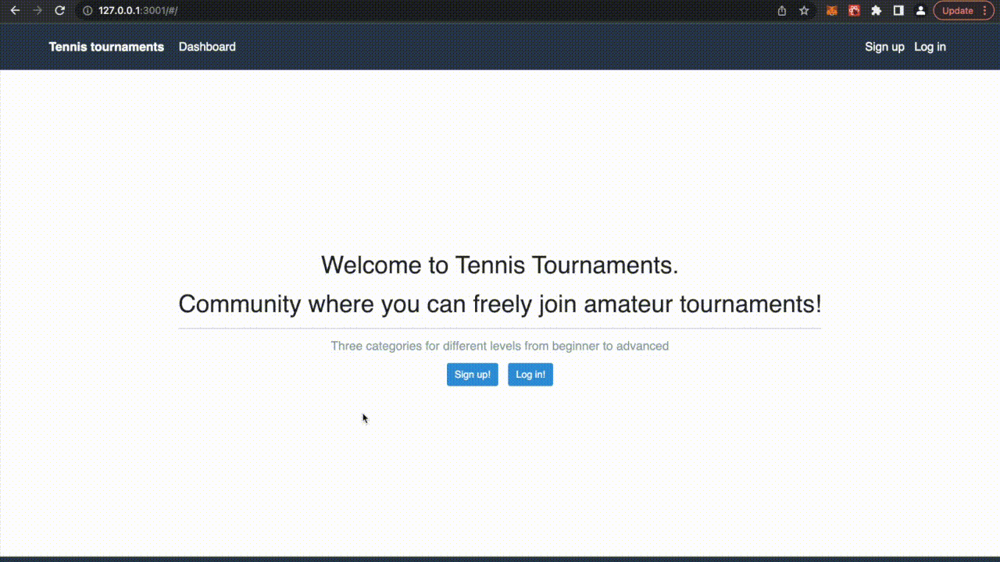
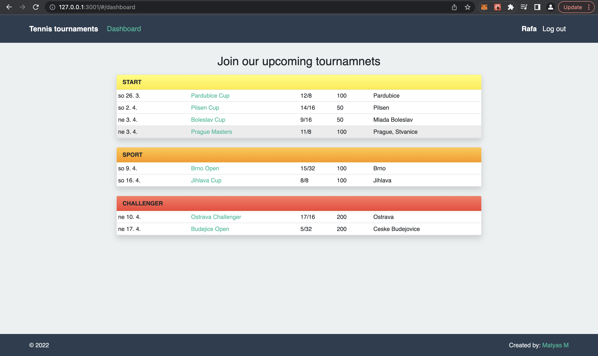
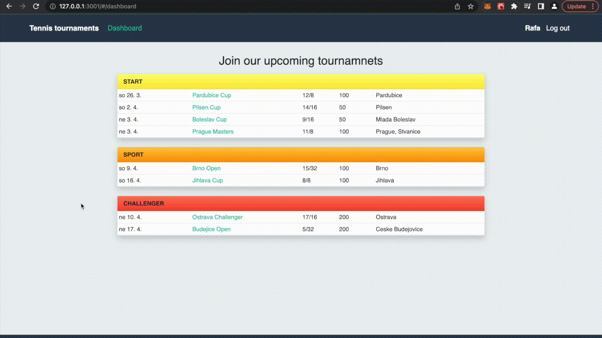
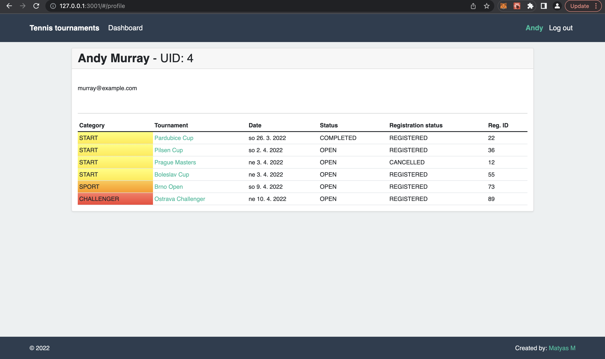
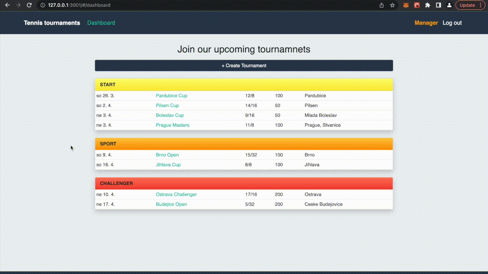
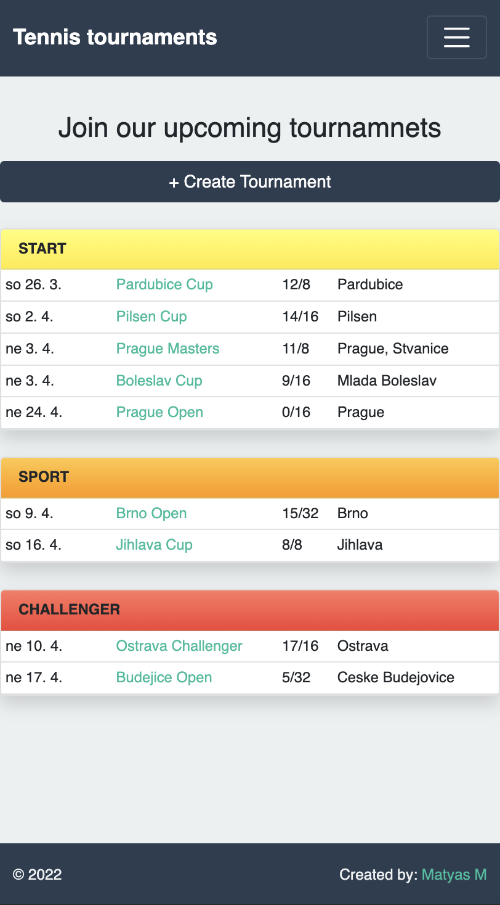
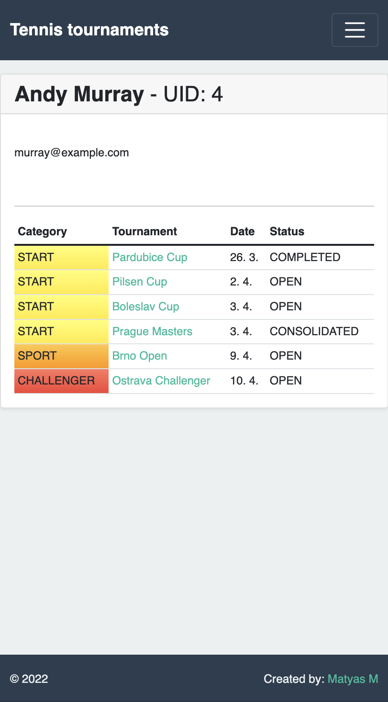

# Tennis-Tournaments

Tennis-Tournaments is a web application which gives a tool to local communities to organize, participate and manage tennis tournaments. The application contains two user groups - regular users and managers. Regular users can manage their registrations of the listed tournaments. Managers can create tournaments in three different categories. Once the tournament is consolidated (started) the competitors can be divided to groups. The manager then can add the match results for each group. After the group stage is completed an elimination draw can be created to determine the champion.

## Application architecture and technologies

The application was designed with up-to-date technologies used for web development. The front-end and back-end are two separate independent services where the back-end is using the REST architectural style. Furthermore the back-end is connected to a Postgres database. The application contains the following:

- Docker containers for back-end, front-end and database
- Docker-compose to bundle together the services in development
- Back-end:
  - Written in Python
  - Django and Django-rest framework
  - Authentication with access and refresh tokens
  - Pytest used for testing
- Front-end:
  - SPA - single page application
  - Written with React
  - React hash router used for navigation
  - React bootstrap used for component styling
  - No specific state management system was used as the state management was transparent enough with useState
  - Cypress used for testing
- Database: Postgres DB, out of box solution from Docker

## Main Features

1. **User authentication:** User can sign up for a new account, then log in with the credentials. Once logged in, the navbar contains user profile link and log out button.  
  
2. **Dashboard:** List of all the available tournaments, divided by categories and sorted by date.
  
3. **Tournament detail page** contains:
   - Basic tournament information
   - Buttons for registration and canceling registration
   - List of players involved in the tournament
   - Once a tournament is consolidated, group stage and elimination stage is visible, where the results can be added by a manager flexibly as the tournament proceeds
   - When a tournament is completed no user or manager actions are allowed  

    
4. **Registrations for tournaments:** At the tournament detail page a user can register for the tournament. If the capacity is full, the user will be added to the waiting list. Once someone cancels their registration, the free capacity will be automatically filled with the next in line user from the waiting list.
  
5. **User profile page:** Displays all the tournaments for which the user is registered.
  
6. **Manager role:** A regular user can be promoted to manager role in the Django admin page which gives special permissions. A manager can additionally:
    - Create tournaments on the dashboard
    - Consolidate and complete tournaments
    - Create groups for competitors in the given tournament
    - Create elimination draws for the final stage of the tournament
    - Add results for both group stage and elimination draws  

    *Manager creates tournament:*
    
    *Manager consolidates tournament, creates group stage and elimination draw:*
    

7. **Mobile responsiveness:** The whole page was designed to be mobile-responsive.

  

    
    
    
  

## Folder structure and file content

The project contains more then 100 files, therefore system generated, self explanatory and setting files will not be described in this paragraph.

### The root directory

`/client` - contains the whole front-end service written in React  
`/server` - contains the whole back-end service written in Python and Django  
`docker-compose` - bundles together the Docker containers for development

### The `/client` folder

`/cypress` - contains the testing files for front-end  
`/public/index.html` - html file which is rendered for all request  
`/src` - all the features are written here  
`/src/components` - React application structure. The features are divided to separate components  
`/src/services` - reusable javaScript helper functions  
`/src/App.css` - main stylesheet  
`/src/App.js` - main React file which contains React Router and the Navbar  
`/src/index.js` - renders the whole React application with hash router  
`Dockerfile` - instructions to build the Docker container

### The `/server` folder

`/tennis` - main Django project folder which contains the settings for the whole back-end and the main url configuration  
`/tests` - all the unit tests divided to separate files written with the help of pytest  
`/tournaments` - all the features are written here
`/tournaments/fixtures` - initial data for project setup  
`/tournaments/migrations` - all the migrations which needs to be applied to the database before the application is started  
`/tournaments/admin.py` - admin interface configuration  
`tournaments/models.py` - all the database models definition  
`tournaments/serializers.py` - contains the main logic how the the application works. Defines how the I/O of the REST communication is serialized to JSON format. The additional validation is also defined here.  
`tournaments/urls.py` - configuration of the urls  
`tournaments/utils.py` - helper functions  
`tournaments/views.py`- contains the Django REST framework views  
`Dockerfile` - instructions to build the Docker container  

## How to run the application

To run this application, you will need to have installed Docker on your device. The following step-by-step guide is written for linux based OS (Mac).

1. Create a new folder and clone the
`master` branch of the actual repository:

        git clone -b master https://github.com/Odusseus55/tennis-tournaments.git .

2. To successfully start the development server of the front-end, first we need to install node_modules. Navigate to client directory, install node_modules with `yarn` then go back to the root directory.

        cd client

        yarn install

        cd ..

3. The services are designed to be independent entities with the help of Docker containers. These containers are bundled together with `docker-compose`. First we need to build the containers. This command is optional but it ensures the images will be always rebuilt and the Docker cache will not be used.

        docker-compose build --no-cache

4. Lets spin up the created containers. Once the containers are running, starting the development servers can take up to one minute.

        docker-compose up -d --build

    Optionally you can check the logs of the containers.  The final message should be from the client container, something like "webpack compiled successfully”.

        docker-compose logs -f

5. Once the services are running we need to run the Django migrations on the server side.

        docker-compose exec tennis-server python manage.py migrate

6. Now open the website on your localhost <http://127.0.0.1:3001/#/>, and you should see the welcome page.

7. The application without data is not presentation worthy. As the last step, lets populate the database with initial data.

        docker-compose exec tennis-server python manage.py loaddata tournaments/fixtures/group.json tournaments/fixtures/initial_data.json

8. Now load the dashboard - <http://127.0.0.1:3001/#/dashboard>, you should see the upcoming tournaments divided into three categories.

9. The site should be running as designed. Feel free to sign up for a new user account or log in with an already created one:
    - email: murray@example.com
    - pw: murray

10. To access the manager features, use the initial manager account:
    - email: manager@example.com
    - pw: manager
